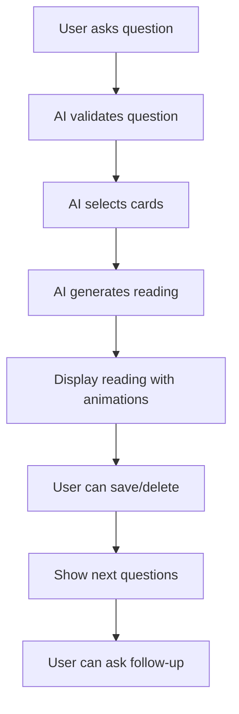
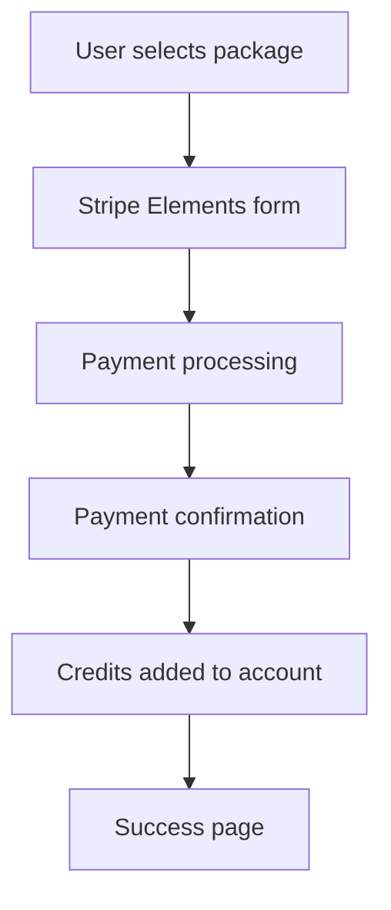

# MiMiVibes - Product Requirements Document (PRD)

## 📋 Document Information

**Document Version**: 1.0  
**Last Updated**: January 2025  
**Author**: หนูกันย์​  
**Project**: MiMiVibes - AI-Powered Tarot Reading Application  
**Status**: Phase 1.5 Complete, Phase 2 In Progress

---

## 🎯 Executive Summary

### Product Vision

MiMiVibes เป็น AI-powered tarot reading application ที่ใช้เทคโนโลยี LangGraph + Gemini AI สำหรับการทำนายไพ่ทาโรต์ในภาษาไทย โดยมุ่งเน้นการสร้างประสบการณ์การอ่านไพ่ที่น่าเชื่อถือ ใช้งานง่าย และเข้าถึงได้ตลอด 24 ชั่วโมง

### Business Objectives

1. **Primary**: สร้าง tarot reading experience ที่น่าเชื่อถือและใช้งานง่าย
2. **Secondary**: Monetization ผ่าน credit system และ gamification
3. **Technical**: Learn modern AI integration และ full-stack development

### Success Metrics

- **User Engagement**: Time on page > 2 นาที, Scroll depth > 70%
- **Conversion**: Sign up rate > 3%, Free trial conversion > 15%
- **Performance**: Page load time < 3 วินาที, Mobile performance > 90 Lighthouse score

---

## 👥 Target Audience

### Primary Users

- **Demographics**: ผู้หญิงอายุ 18-35 ปี
- **Interests**: Tarot, spirituality, self-discovery, personal guidance
- **Behavior**: ใช้งานมือถือเป็นหลัก, ชอบ social media, ต้องการคำแนะนำในชีวิต
- **Pain Points**: ต้องการคำแนะนำที่เชื่อถือได้, ไม่มีเวลาไปหาผู้เชี่ยวชาญ, ต้องการความเป็นส่วนตัว

### Secondary Users

- **Demographics**: คนทั่วไปอายุ 18-50 ปี
- **Interests**: การตัดสินใจในชีวิต, การหามุมมองใหม่, การพัฒนาตัวเอง
- **Behavior**: ใช้งานมือถือและ desktop, ต้องการข้อมูลก่อนตัดสินใจ

### User Personas

#### Persona 1: "สมใจ" - The Spiritual Seeker

- **Age**: 28 ปี
- **Occupation**: Office worker
- **Goals**: หาคำแนะนำเรื่องความรักและอาชีพ
- **Pain Points**: ไม่มีเวลาไปหาผู้เชี่ยวชาญ, ต้องการคำแนะนำที่แม่นยำ
- **Tech Comfort**: Intermediate

#### Persona 2: "นิดา" - The Decision Maker

- **Age**: 35 ปี
- **Occupation**: Entrepreneur
- **Goals**: ตัดสินใจเรื่องธุรกิจและการลงทุน
- **Pain Points**: ต้องการข้อมูลหลายมุมมอง, ต้องการความมั่นใจ
- **Tech Comfort**: Advanced

#### Persona 3: "มณี" - The Daily User

- **Age**: 22 ปี
- **Occupation**: Student
- **Goals**: เข้าใจตัวเองและสถานการณ์รอบตัว
- **Pain Points**: ต้องการคำแนะนำประจำวัน, งบประมาณจำกัด
- **Tech Comfort**: Beginner

---

## 🏗️ Technical Architecture

### Tech Stack

- **Frontend**: Next.js 14, React 18, TypeScript, DaisyUI + Tailwind CSS
- **Backend**: Node.js API routes, Supabase PostgreSQL
- **Database**: Prisma ORM, PostgreSQL
- **Authentication**: Clerk (LINE LIFF integration)
- **AI**: LangGraph workflow + Gemini 2.0 Flash
- **Payments**: Stripe integration
- **Animation**: Framer Motion
- **Deployment**: Vercel

### System Architecture

```
┌─────────────────┐    ┌─────────────────┐    ┌─────────────────┐
│   Frontend      │    │   Backend       │    │   External      │
│   (Next.js)     │◄──►│   (API Routes)  │◄──►│   Services      │
└─────────────────┘    └─────────────────┘    └─────────────────┘
         │                       │                       │
         │                       │                       │
         ▼                       ▼                       ▼
┌─────────────────┐    ┌─────────────────┐    ┌─────────────────┐
│   Clerk Auth    │    │   Prisma ORM    │    │   Gemini AI     │
│   (LINE LIFF)   │    │   PostgreSQL    │    │   LangGraph     │
└─────────────────┘    └─────────────────┘    └─────────────────┘
         │                       │                       │
         │                       │                       │
         ▼                       ▼                       ▼
┌─────────────────┐    ┌─────────────────┐    ┌─────────────────┐
│   Stripe        │    │   Framer Motion │    │   Vercel        │
│   Payments      │    │   Animations    │    │   Deployment    │
└─────────────────┘    └─────────────────┘    └─────────────────┘
```

---

## 📱 Core Features

### 1. Authentication System

**Priority**: Critical  
**Status**: ✅ Complete

#### Requirements

- Clerk authentication integration
- LINE LIFF support for mobile users
- User profile management
- Session management
- Security best practices

#### User Stories

- As a user, I want to sign up easily with my LINE account
- As a user, I want my profile to be automatically created
- As a user, I want to stay logged in across sessions

#### Technical Specifications

```typescript
// User Profile Structure
interface User {
  id: string;
  clerkId: string;
  email: string;
  name: string;
  avatar: string;
  level: number;
  exp: number;
  createdAt: Date;
  updatedAt: Date;
}
```

### 2. AI Tarot Reading System

**Priority**: Critical  
**Status**: ✅ Complete

#### Requirements

- LangGraph workflow integration
- Gemini 2.0 Flash AI for reading generation
- 78 tarot cards database
- Thai language reading generation
- Cultural sensitivity in readings
- Question validation system

#### User Stories

- As a user, I want to ask questions about my life
- As a user, I want to receive accurate tarot readings in Thai
- As a user, I want the AI to understand my context
- As a user, I want to see the cards that were selected

#### Technical Specifications

```typescript
// Reading Structure
interface Reading {
  id: string;
  userId: string;
  question: string;
  questionAnalysis: QuestionAnalysis;
  cards: Card[];
  reading: ReadingStructure;
  rewards: RewardStructure;
  createdAt: Date;
  isDeleted: boolean;
}

interface ReadingStructure {
  header: string;
  cards_reading: CardObject[];
  reading: string;
  suggestions: string[];
  final: string;
  end: string;
  notice: string;
  next_questions: string[];
}
```

### 3. User Interface & Experience

**Priority**: Critical  
**Status**: ✅ Complete

#### Requirements

- Article-style reading display (replacing chat interface)
- Auto-hide navbar for mobile
- Framer Motion animations
- Responsive design (mobile-first)
- Loading states and error handling
- Save/delete reading functionality

#### User Stories

- As a user, I want to see my reading in a beautiful article format
- As a user, I want smooth animations when cards are revealed
- As a user, I want to save important readings for later
- As a user, I want the interface to work well on my phone

#### Technical Specifications

```typescript
// UI Components
- AskPage.tsx (main orchestrator)
- HeroSection.tsx (question input)
- LoadingState.tsx (loading animation)
- AnimatedArticleDisplay.tsx (reading display)
- AutoHideNavbar.tsx (navigation)
```

### 4. Credit & Payment System

**Priority**: High  
**Status**: ✅ Complete

#### Requirements

- Stripe integration for payments
- Credit system (stars and free points)
- Package selection interface
- Payment confirmation flow
- Transaction history
- Credit deduction system

#### User Stories

- As a user, I want to buy credits easily
- As a user, I want to see my credit balance
- As a user, I want to understand pricing clearly
- As a user, I want secure payment processing

#### Technical Specifications

```typescript
// Credit System
interface UserCredits {
  stars: number;
  freePoint: number;
  canRead: boolean;
}

// Payment Packages
interface Package {
  id: string;
  name: string;
  price: number;
  credits: number;
  features: string[];
  popular?: boolean;
}
```

### 5. Gamification System

**Priority**: Medium  
**Status**: ✅ Complete

#### Requirements

- EXP and level system
- Daily login rewards
- Achievement badges
- Referral system
- Coin exchange system

#### User Stories

- As a user, I want to level up by using the app
- As a user, I want daily rewards for logging in
- As a user, I want to earn rewards by referring friends
- As a user, I want to see my achievements

#### Technical Specifications

```typescript
// Gamification Structure
interface UserStats {
  level: number;
  exp: number;
  coins: number;
  achievements: Achievement[];
  dailyLoginStreak: number;
  totalReadings: number;
}

interface Achievement {
  id: string;
  name: string;
  description: string;
  icon: string;
  unlocked: boolean;
  unlockedAt?: Date;
}
```

### 6. History & Search System

**Priority**: High  
**Status**: ✅ Complete

#### Requirements

- Reading history with pagination
- Advanced search and filtering
- Reading detail modal
- Delete functionality
- Review system

#### User Stories

- As a user, I want to see all my past readings
- As a user, I want to search for specific readings
- As a user, I want to review the accuracy of readings
- As a user, I want to delete readings I don't want to keep

#### Technical Specifications

```typescript
// Search & Filter
interface SearchFilters {
  text: string;
  dateRange: DateRange;
  topic: string;
  reviewStatus: ReviewStatus;
  cardCount: number;
}

interface Review {
  readingId: string;
  userId: string;
  accurateLevel: number; // 0, 20, 50, 80, 100
  comment?: string;
  createdAt: Date;
}
```

---

## 🎨 Design System

### Brand Identity

- **Name**: MiMiVibes
- **Tagline**: "เปิดเผยอนาคตของคุณด้วย AI ไพ่ทาโรต์แห่งแรกของไทย!"
- **Personality**: Mystical, Warm, Modern, Trustworthy, Exciting, Empowering

### Color Palette

```css
Primary: #629c6b (เขียวธรรมชาติ - ความเจริญเติบโต)
Secondary: #66836a (เขียวเข้ม - ความมั่นคง)
Accent: #de5b25 (ส้ม - พลังและความกระตือรือร้น)
Neutral: #bfb8b1 (เบจ - ความสงบ)
Base: #ffffff (ขาว - ความบริสุทธิ์)
```

### Typography

- **Font**: Inter (Google Fonts)
- **Headings**: Bold, primary color
- **Body**: Regular, base-content color
- **Thai Language**: Optimized for readability

### Visual Elements

- **Tarot Cards**: 78 tarot cards with high-quality images
- **Animations**: Framer Motion for smooth transitions
- **Icons**: Lucide React icons
- **Gradients**: Mystical gradients (base-100 → base-200)

---

## 📊 Data Models

### Database Schema

```sql
-- Core Tables
User (id, clerkId, email, name, avatar, level, exp, createdAt, updatedAt)
Card (id, name, image, meaning, reversedMeaning, suit, number)
Reading (id, userId, question, questionAnalysis, cards, reading, rewards, createdAt, isDeleted)
PointTransaction (id, userId, type, amount, metadata, createdAt)
Review (id, readingId, userId, accurateLevel, comment, createdAt)
ReferralCode (id, userId, code, usageCount, createdAt)

-- Gamification Tables
Achievement (id, name, description, icon, requirement, reward)
UserAchievement (id, userId, achievementId, unlockedAt)
Campaign (id, name, type, startDate, endDate, reward)
UserCampaign (id, userId, campaignId, completedAt)
```

### API Endpoints

```typescript
// Authentication
GET / PUT / api / user / profile;
GET / api / user / stats;
GET / api / user / credits;

// Readings
POST / api / readings / ask;
GET / api / readings / history;
POST / api / readings / [id] / save;
DELETE / api / readings / [id];

// Payments
GET / api / payments / packages;
POST / api / payments / create - intent;
POST / api / payments / confirm;
POST / api / webhooks / stripe;

// Gamification
GET / api / gamification / levels;
POST / api / gamification / level - up;
GET / api / campaigns / daily - login / status;
POST / api / campaigns / daily - login / claim;

// Reviews
POST / api / reviews / [readingId];
GET / api / reviews / [readingId];

// Referrals
POST / api / referrals / validate;
POST / api / referrals / process;
GET / api / referrals / status;
```

---

## 🔄 User Flows

### Primary User Journey

1. **Landing Page** → User discovers MiMiVibes
2. **Sign Up** → User creates account via Clerk/LINE
3. **First Reading** → User asks question and receives reading
4. **Explore Features** → User discovers history, profile, packages
5. **Engage** → User continues using app, earns rewards
6. **Convert** → User purchases credits for unlimited access

### Reading Flow



### Payment Flow



---

## 📈 Success Metrics & KPIs

### User Engagement

- **Daily Active Users (DAU)**: Target 1,000+ users
- **Time on App**: Target > 5 minutes per session
- **Readings per User**: Target > 3 readings per week
- **Retention Rate**: Target > 40% after 7 days

### Business Metrics

- **Monthly Recurring Revenue (MRR)**: Target ฿50,000+
- **Customer Acquisition Cost (CAC)**: Target < ฿200
- **Lifetime Value (LTV)**: Target > ฿1,000
- **Conversion Rate**: Target > 5% free to paid

### Technical Metrics

- **Page Load Time**: Target < 3 seconds
- **API Response Time**: Target < 1 second
- **Error Rate**: Target < 1%
- **Mobile Performance**: Target > 90 Lighthouse score

### Quality Metrics

- **Reading Accuracy**: Target > 80% user satisfaction
- **Review Ratings**: Target > 4.5/5 stars
- **Support Tickets**: Target < 5% of users
- **App Store Rating**: Target > 4.5/5 stars

---

## 🚀 Development Phases

### Phase 1: Core Platform (COMPLETED ✅)

**Duration**: 6 rounds, 20-25 hours  
**Status**: ✅ Complete

#### Round 1: Foundation Setup ✅

- Next.js 14 + Clerk authentication + MiMiVibes theme
- **Deliverables**: Basic app structure, authentication, theme

#### Round 2: Database Layer ✅

- Prisma ORM + PostgreSQL + user management APIs
- **Deliverables**: Database schema, user management, 78 tarot cards

#### Round 3: LangGraph Integration ✅

- AI workflow + Gemini AI + reading generation
- **Deliverables**: AI reading system, SSE streaming

#### Round 4: Chat UI & User Experience ✅

- Gemini-style chat interface + 3D card animations
- **Deliverables**: Chat interface, card animations, real-time messaging

#### Round 5: Payment System ✅

- Stripe integration + credit management
- **Deliverables**: Payment processing, credit system

#### Round 6: Gamification Features ✅

- EXP system + daily rewards + referral system
- **Deliverables**: Gamification, rewards, referral system

### Phase 1.5: Major /ask Page Redesign (COMPLETED ✅)

**Duration**: 8 rounds, 30-35 hours  
**Status**: ✅ Complete

#### Round 7A: Database Schema & API Overhaul ✅

- JSON reading structure + hard reset
- **Deliverables**: New reading format, API updates

#### Round 7B: Article-Style UI Components ✅

- Single-page experience replacing chat interface
- **Deliverables**: Article-style UI, auto-hide navbar

#### Round 7C: Animation & UX Polish ✅

- Framer Motion animations + error handling
- **Deliverables**: Smooth animations, error handling

#### Round 7D: Critical Bug Fixes ✅

- Data synchronization + UI improvements
- **Deliverables**: Bug fixes, UI enhancements

#### Round 7E: Review System ✅

- 5-level rating system + rewards
- **Deliverables**: Review system, rating interface

#### Round 7F: Referral System ✅

- Referral links + reward distribution
- **Deliverables**: Referral system, reward tracking

#### Round 7G: URL Parameter Processing ✅

- Referral code processing + validation
- **Deliverables**: Referral validation, URL processing

#### Round 7H: Database Cleanup ✅

- Schema optimization + JSON standardization
- **Deliverables**: Database cleanup, performance optimization

### Phase 2: Enhanced Features (IN PROGRESS 🚀)

**Duration**: 5 rounds, 20-25 hours  
**Status**: Round 8 ✅, Round 9 ✅

#### Round 8: Frontend API Integration ✅

- Profile + History pages with real APIs
- **Deliverables**: Enhanced profile, advanced search, infinite scroll

#### Round 9: Stripe Payment UI Integration ✅

- Stripe Elements + package selection
- **Deliverables**: Payment UI, package selection, confirmation flow

#### Round 10: Gamification UI Components (PLANNED)

- Level display + daily rewards + coin exchange
- **Deliverables**: Gamification UI, achievement system

#### Round 11: Error Handling & Loading States (PLANNED)

- Error boundaries + retry mechanisms
- **Deliverables**: Error handling, loading states

#### Round 12: Performance Optimization (PLANNED)

- Caching + optimization + mobile improvements
- **Deliverables**: Performance optimization, caching

#### Round 13: Final Integration & Testing (PLANNED)

- End-to-end testing + production readiness
- **Deliverables**: Testing, deployment preparation

---

## 🎯 Feature Prioritization

### Must Have (Critical)

- ✅ Authentication system
- ✅ AI tarot reading system
- ✅ User interface & experience
- ✅ Credit & payment system
- ✅ History & search system
- ✅ Review system
- ✅ Referral system

### Should Have (High Priority)

- 🚧 Gamification UI components
- 🚧 Error handling & loading states
- 🚧 Performance optimization
- 🚧 Mobile responsiveness improvements

### Could Have (Medium Priority)

- 📋 Advanced analytics dashboard
- 📋 Social sharing features
- 📋 Multiple reading types
- 📋 Personalized recommendations

### Won't Have (Low Priority)

- ❌ Video consultations
- ❌ Live chat support
- ❌ Multi-language support (beyond Thai)
- ❌ Offline mode

---

## 🔒 Security & Privacy

### Data Protection

- **Encryption**: All data encrypted in transit and at rest
- **Authentication**: Secure Clerk authentication with JWT
- **Authorization**: Role-based access control
- **Audit Logging**: All actions logged for security

### Privacy Compliance

- **GDPR Compliance**: User data rights and consent
- **Data Minimization**: Only collect necessary data
- **Data Retention**: Automatic deletion of old data
- **User Control**: Users can delete their data

### Payment Security

- **PCI Compliance**: Stripe handles payment data
- **Tokenization**: Payment tokens instead of raw data
- **Fraud Prevention**: Stripe's built-in fraud detection
- **Refund Policy**: Clear refund terms and conditions

---

## 📱 Platform Requirements

### Web Application

- **Browser Support**: Chrome, Safari, Firefox, Edge (latest 2 versions)
- **Responsive Design**: Mobile-first approach
- **Progressive Web App**: PWA capabilities for mobile
- **Performance**: Lighthouse score > 90

### Mobile Optimization

- **Touch Targets**: Minimum 44px for interactive elements
- **Safe Areas**: iOS safe area support
- **Offline Support**: Basic offline functionality
- **App-like Experience**: Native app feel on mobile

### Accessibility

- **WCAG 2.1 AA**: Accessibility compliance
- **Screen Reader**: Full screen reader support
- **Keyboard Navigation**: Complete keyboard accessibility
- **Color Contrast**: Minimum 4.5:1 contrast ratio

---

## 🧪 Testing Strategy

### Unit Testing

- **Coverage**: > 80% code coverage
- **Framework**: Jest + React Testing Library
- **Components**: All React components tested
- **API Routes**: All API endpoints tested

### Integration Testing

- **Database**: Prisma integration tests
- **External APIs**: Stripe, Clerk, Gemini AI tests
- **Workflows**: End-to-end user flows
- **Performance**: Load testing and optimization

### User Testing

- **Usability Testing**: Real user feedback
- **A/B Testing**: Feature comparison
- **Beta Testing**: Limited user group
- **Feedback Collection**: User surveys and interviews

---

## 📊 Analytics & Monitoring

### User Analytics

- **Google Analytics**: Page views, user behavior
- **Custom Events**: Reading completions, payments
- **Conversion Tracking**: Sign up to paid conversion
- **Cohort Analysis**: User retention patterns

### Performance Monitoring

- **Vercel Analytics**: Performance metrics
- **Error Tracking**: Sentry for error monitoring
- **API Monitoring**: Response times, error rates
- **Database Monitoring**: Query performance, connection health

### Business Intelligence

- **Revenue Tracking**: MRR, LTV, CAC
- **User Engagement**: DAU, MAU, session duration
- **Feature Usage**: Most used features, drop-off points
- **Customer Feedback**: Reviews, support tickets

---

## 🚀 Deployment & DevOps

### Development Environment

- **Local Development**: Docker containers
- **Code Quality**: ESLint, Prettier, TypeScript
- **Git Workflow**: Feature branches, pull requests
- **Code Review**: Mandatory code review process

### Staging Environment

- **Testing**: Automated testing pipeline
- **Performance**: Load testing and optimization
- **Security**: Security scanning and audits
- **User Acceptance**: Stakeholder testing

### Production Environment

- **Deployment**: Vercel automatic deployment
- **Monitoring**: Real-time monitoring and alerts
- **Backup**: Automated database backups
- **Scaling**: Auto-scaling based on demand

---

## 📋 Risk Assessment

### Technical Risks

- **AI Model Performance**: Gemini AI API limitations
- **Scalability**: Database performance under load
- **Security**: Data breaches or vulnerabilities
- **Integration**: Third-party service dependencies

### Business Risks

- **Market Competition**: Other tarot apps
- **Regulatory**: Legal requirements for AI services
- **User Adoption**: Low user engagement
- **Monetization**: Insufficient revenue generation

### Mitigation Strategies

- **Redundancy**: Multiple AI providers as backup
- **Monitoring**: Proactive performance monitoring
- **Security Audits**: Regular security assessments
- **User Research**: Continuous user feedback collection

---

## 📅 Timeline & Milestones

### Phase 1: Core Platform (COMPLETED ✅)

- **Start Date**: January 2025
- **End Date**: January 2025
- **Duration**: 20-25 hours
- **Status**: ✅ Complete

### Phase 1.5: /ask Page Redesign (COMPLETED ✅)

- **Start Date**: January 2025
- **End Date**: January 2025
- **Duration**: 30-35 hours
- **Status**: ✅ Complete

### Phase 2: Enhanced Features (IN PROGRESS 🚀)

- **Start Date**: January 2025
- **End Date**: February 2025
- **Duration**: 20-25 hours
- **Status**: Round 8 ✅, Round 9 ✅

### Phase 3: Production Launch (PLANNED)

- **Start Date**: February 2025
- **End Date**: February 2025
- **Duration**: 10-15 hours
- **Status**: Planned

---

## 💰 Budget & Resources

### Development Costs

- **Development Time**: 70-85 hours total
- **Hourly Rate**: ฿1,000/hour (estimated)
- **Total Development Cost**: ฿70,000-85,000

### Infrastructure Costs (Monthly)

- **Vercel Hosting**: ฿1,000/month
- **Supabase Database**: ฿500/month
- **Stripe Processing**: 2.9% + ฿3 per transaction
- **Clerk Authentication**: ฿500/month
- **Total Infrastructure**: ฿2,000/month

### Marketing Costs (Monthly)

- **Digital Advertising**: ฿10,000/month
- **Content Marketing**: ฿5,000/month
- **Social Media**: ฿3,000/month
- **Total Marketing**: ฿18,000/month

---

## 📞 Support & Maintenance

### Customer Support

- **Support Channels**: Email, in-app chat, LINE
- **Response Time**: < 24 hours for general inquiries
- **Escalation**: Technical issues escalated to development team
- **Documentation**: User guides and FAQ

### Maintenance

- **Regular Updates**: Monthly feature updates
- **Security Patches**: Immediate security updates
- **Performance Optimization**: Continuous monitoring and optimization
- **Backup & Recovery**: Daily backups with disaster recovery plan

---

## 📚 Appendices

### Appendix A: Technical Specifications

- Detailed API documentation
- Database schema diagrams
- Component architecture
- Deployment procedures

### Appendix B: User Research

- User interviews and surveys
- Competitor analysis
- Market research findings
- User persona details

### Appendix C: Design Assets

- Brand guidelines
- UI/UX mockups
- Icon and image assets
- Animation specifications

### Appendix D: Legal & Compliance

- Terms of service
- Privacy policy
- Data processing agreements
- Regulatory compliance documentation

---

**Document End**

_This PRD is a living document and will be updated as the project evolves._
